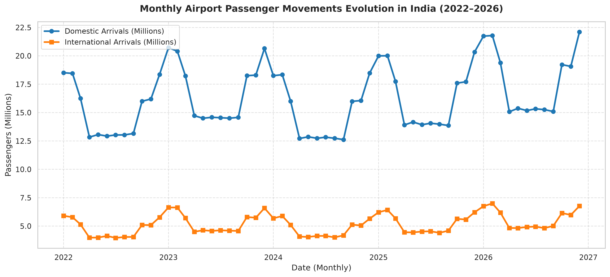
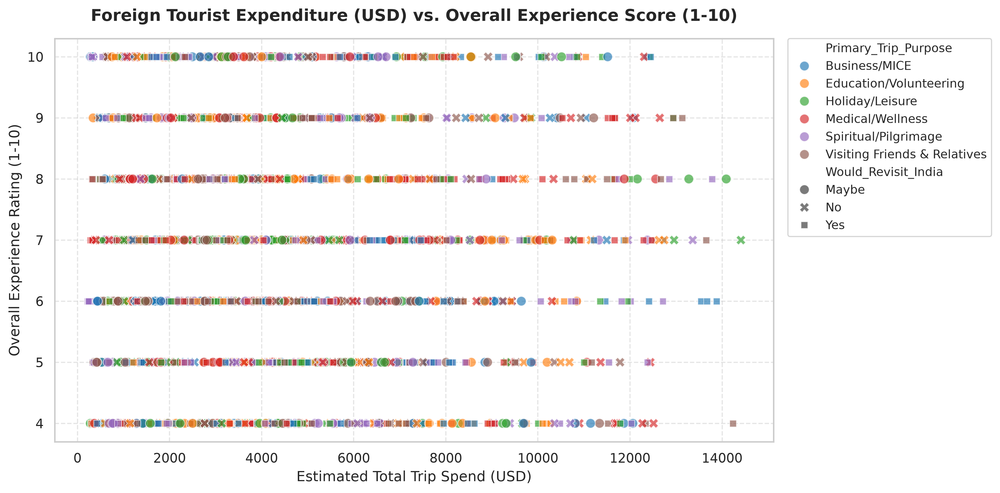
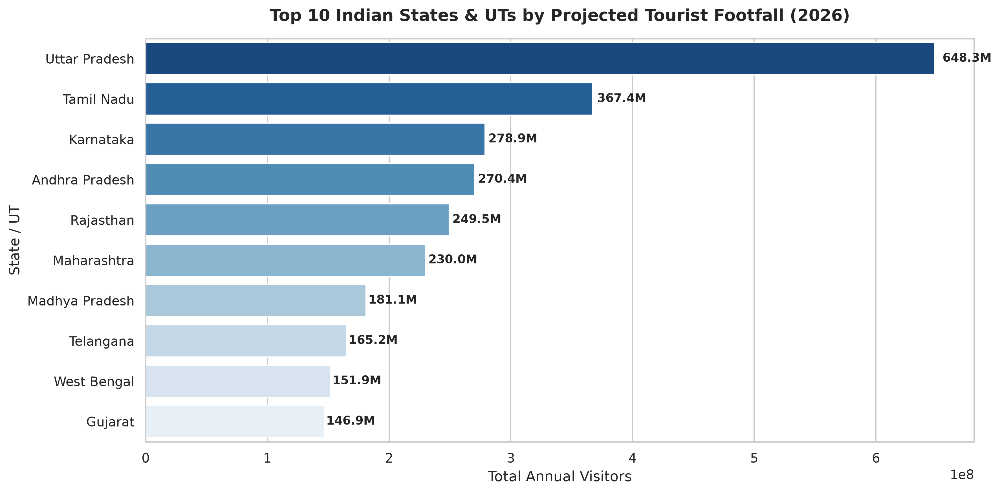
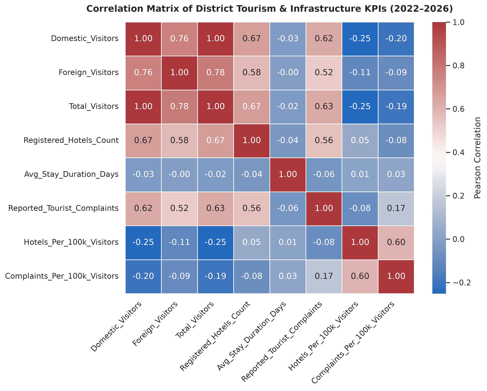
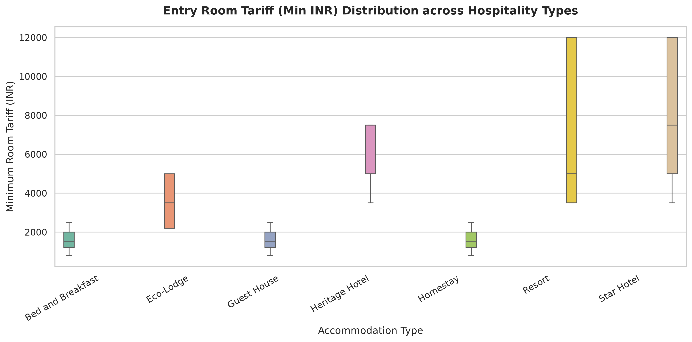

# 🇮🇳 India Tourism Analytics & Econometric Pipeline (2022–2026)

### Project Information

*Project Title:*  
India Tourism Analytics & Econometric Pipeline (2022–2026)

*Industry Name:*  
Tourism & Hospitality / Travel & Civil Aviation

*Problem Statement:*  
India's tourism and hospitality sector experiences massive disparities across regional tourist footfalls, foreign visitor concentration, seasonal fluctuations, accommodation infrastructure gaps, and civil aviation gateway capacities. Without a unified, cross-domain empirical analysis across districts, official hospitality registries, centrally protected heritage monuments, and airport gateways, state tourism boards and private hospitality stakeholders struggle with resource misallocation, regional infrastructure bottlenecks, and suboptimal international tourist retention.

*Proposed Solution / Analysis Questions:*  
Develop an end-to-end Python data analytics and econometric pipeline integrating multi-departmental public sector datasets to address critical industry questions:
* Which Indian districts lead in inbound foreign tourist density, and where should international tourism infrastructure be prioritized?
* How do diverse tourism categories (Nature/Eco, Beach, Heritage, Religious, Business, Wildlife, Hill Station) perform in domestic footfalls, foreign arrivals, and tourist dwell times?
* How do foreign tourist trip expenditures, daily spending velocity, and satisfaction ratings (NPS) correlate across international source regions?
* What are the traffic volumes and international exposure ratios across major civil aviation gateway airports?
* What are the pricing structures and room tariff spreads across different accommodation categories (Heritage Hotels, Star Hotels, Resorts, Homestays, B&Bs)?

*Dataset Name:*  
India Tourism & Hospitality Multi-Domain Master Dataset (2022–2026)
* District-wise Tourist Footfall Data (2022–2024)
* NIDHI Hospitality Establishments Registry
* ASI Centrally Protected Monuments Inventory
* Inbound Foreign Tourist Survey Microdata (2023–2024)
* Civil Aviation Airport Monthly Passenger Traffic (2022–2024)
* Annual Macro Tourism Overview & Country-wise FTA Summaries

*Dataset Source:*  
Official Government Portals and Statistical Reports:
* Ministry of Tourism (MoT), Government of India (India Tourism Statistics - ITS, Annual Reports, and PIB Bulletins)
* National Integrated Database of Hospitality Industry (NIDHI) Portal
* Archaeological Survey of India (ASI), Ministry of Culture
* Bureau of Immigration (BOI), Ministry of Home Affairs
* Directorate General of Civil Aviation (DGCA) & Airports Authority of India (AAI)

*Tools & Technologies:*  
* Python (3.10+)
* Jupyter Notebook
* NumPy
* Pandas
* Matplotlib
* Seaborn
* SciPy
* ReportLab (Automated PDF Report Generation)
* Git & GitHub

---

### Project Workflow

Use the following workflow in the README:

*Industry Selection → Problem Identification → Dataset Collection → Data Cleaning → Data Transformation → Data Analysis → Data Visualization → Insights → Recommendations*

---

### Data Analysis & Visualization

The project performs the following actual data analyses and visualizations based on the cleaned and integrated multi-domain dataset:

* **Time-based & Trend Analysis**:  
  Analyzed monthly airport passenger movement trajectories (2022–2026) across 40 civil aviation gateways to evaluate post-pandemic passenger traffic recovery and seasonal influx patterns.
  *(Visualization: `Visualizations/01_monthly_airport_passenger_movements.png`)*

* **Relationship & Correlation Analysis**:  
  Evaluated the empirical relationship between total foreign tourist expenditure (USD) and visitor experience rating (1–10 scale) across source regions, highlighting spending velocity and Net Promoter Sentiment.
  *(Visualization: `Visualizations/02_inbound_spend_vs_experience.png`)*

* **Comparison & Ranking Analysis**:  
  Conducted comparative ranking of state and union territory jurisdictions based on projected 2026 domestic and foreign tourist footfalls to identify top regional tourism growth drivers.
  *(Visualization: `Visualizations/03_top_10_states_footfall_2026.png`)*

* **Correlation Analysis**:  
  Generated a Pearson correlation matrix analyzing relationships between tourist footfalls, classified hotel room capacities, ASI heritage monuments, and recorded tourist complaints across 474 districts.
  *(Visualization: `Visualizations/04_district_infrastructure_correlation_matrix.png`)*

* **Distribution & Category-wise Analysis**:  
  Examined the spread and variance of room tariffs across different hospitality formats (Heritage Hotels, Star Hotels, Resorts, Eco-Lodges, Guest Houses, B&Bs, and Homestays) to profile accommodation affordability.
  *(Visualization: `Visualizations/05_room_tariff_distribution_by_accommodation.png`)*

---

### Key Insights

* **Inbound Concentration vs. Destination Density**: While classical urban gateways such as Chennai and Jaipur attract high aggregate volumes, districts such as **Ernakulam (20.08%)** and **Puri (14.99%)** exhibit the highest inbound foreign visitor density, requiring targeted international service facilities.
* **Category Performance (Volume vs. Value)**: **Nature / Eco-Tourism** commands the highest average foreign tourist footfall (**42,150 visitors/district**) and longest dwell time (**3.0 days**), whereas **Beach Tourism** generates the largest average domestic volume (**1.30M visitors/district**).
* **Spending Velocity & Source Markets**: Tourists from **Oceania** ($257.70/day) and the **Americas** ($224.50/day) lead in daily spending velocity. Visitors from **South Asia** (31.9%) and the **Americas** (28.7%) recorded the highest Net Promoter Sentiment, representing the highest organic referral potential.
* **Aviation Gateway Exposure**: Delhi (DEL - 95.7M) and Mumbai (BOM - 80.3M) drive total domestic and international throughput; however, **Cochin (COK - 48.4%)** and **Thiruvananthapuram (TRV - 46.0%)** demonstrate the highest international traffic dependency ratios.
* **Hospitality Price Structure**: Heritage and Star hotels maintain median peak tariffs of ₹19,250–₹20,000 with wide tariff spreads (₹14,655–₹15,712), whereas Homestays and B&Bs provide affordable options (₹1,500–₹3,500) while sustaining solid quality audit scores (75.7–79.7/100).

---

### Recommendations

* **Target High Foreign Density Destinations**: Deploy dedicated multi-lingual tourist information centers, foreign exchange facilities, and international digital payment infrastructure in high foreign-density nodes like Ernakulam and Puri.
* **Promote Eco & Nature Tourism Corridors**: Expand sustainable eco-resorts, certified homestays, and community-guided tours in Nature/Eco districts to leverage their superior dwell times and high foreign tourist engagement.
* **Focus Inbound Marketing on High-Yield Geographies**: Direct targeted international marketing campaigns and streamlined visa initiatives toward Oceania and North America to maximize foreign exchange earnings.
* **Expand International Gateway Facilities in the South**: Upgrade immigration counters, customs clearance lanes, and connecting transit infrastructure at high international-share airports like Cochin (COK) and Thiruvananthapuram (TRV).
* **Standardize Alternative Lodging Standards**: Broaden NIDHI accreditation, safety audits, and hospitality skill training for homestays and B&Bs to preserve quality and affordable lodging supply across emerging circuits.

---

## Visualization Screenshots

### Monthly Airport Passenger Movements (2022–2026)



### Inbound Foreign Tourist Spend vs Experience & Satisfaction



### Top 10 States by Projected Tourist Footfall (2026)



### District Infrastructure & Footfall Correlation Matrix



### Room Tariff Distribution Across Accommodation Types



---

### Project Folder Structure

```text
india-tourism-analysis/
│
├── README.md                                    # Project documentation & summary
├── requirements.txt                             # Python dependencies
├── LICENSE                                      # MIT License
├── .gitignore                                   # Git ignore configuration
│
├── data/                                        # Data architecture root
│   ├── README.md                                # Data dictionary & methodology
│   ├── raw/                                     # Raw untouched public datasets
│   │   ├── 01_district_wise_tourist_footfall_2022_2024.csv
│   │   ├── 02_nidhi_hospitality_establishments_registry.csv
│   │   ├── 03_asi_protected_monuments_inventory.csv
│   │   ├── 04_inbound_tourist_survey_microdata_2023_2024.csv
│   │   ├── 05_airport_passenger_traffic_monthly_2022_2024.csv
│   │   ├── 06_annual_macro_overview_2022_2024.csv
│   │   ├── 07_country_wise_fta_summary_2022_2024.csv
│   │   └── 08_state_ut_consolidated_summary_2022_2023.csv
│   └── cleaned/                                 # Cleaned and processed datasets
│       ├── 01_district_wise_tourist_footfall_cleaned.csv
│       ├── 02_nidhi_hospitality_establishments_cleaned.csv
│       ├── 03_asi_protected_monuments_cleaned.csv
│       ├── 04_inbound_tourist_survey_cleaned.csv
│       ├── 05_airport_passenger_traffic_cleaned.csv
│       ├── 06_annual_macro_overview_cleaned.csv
│       ├── 07_country_wise_fta_cleaned.csv
│       ├── 08_state_ut_consolidated_cleaned.csv
│       └── unified_district_master_2026.csv
│
├── python/                                      # Jupyter Notebooks
│   ├── 00_master_pipeline.ipynb                 # Master end-to-end pipeline
│   ├── 01_data_ingestion_and_inspection.ipynb   # Ingestion & schema audit
│   ├── 02_datatype_optimization.ipynb           # Type casting & memory optimization
│   ├── 03_missing_value_imputation.ipynb        # Statistical imputation
│   ├── 04_feature_engineering.ipynb             # Feature creation & metric derivation
│   ├── 05_relational_merge.ipynb                # Master multi-table merge
│   ├── 06_exploratory_and_econometric_analysis.ipynb # Statistical analysis & segmentation
│   └── 07_visualizations_and_dashboards.ipynb   # Publication-grade visualizations
│
├── src/                                         # Automated data pipeline scripts
│   ├── clean_data.py                            # Data cleaning script
│   ├── convert_niti.py                          # NITI Aayog conversion utility
│   └── fetch_data.py                            # Data ingestion module
│
├── results/                                     # Generated analysis outputs
│   ├── India_Tourism_Presentation.pptx          # Executive 12-slide presentation
│   ├── India_Tourism_Project_Report.pdf         # Comprehensive project report
│   ├── summary_findings.md                      # Key findings summary
│   ├── plots/                                   # High-resolution plot outputs
│   └── tables/                                  # Exported analytical tables
│
└── Visualizations/                              # Visualizations for GitHub display
    ├── 01_monthly_airport_passenger_movements.png
    ├── 02_inbound_spend_vs_experience.png
    ├── 03_top_10_states_footfall_2026.png
    ├── 04_district_infrastructure_correlation_matrix.png
    └── 05_room_tariff_distribution_by_accommodation.png
```

---

### Author

* *Name:* Thillai valavan A S
* *Student ID:* AF05309210
* *Organization:* Anudip Foundation
* *Course:* AIML
* *Batch Code:* ANP-D7444
